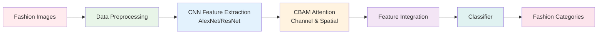
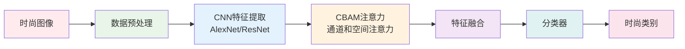

# Fashion Item Classification Project | 时尚商品分类项目

 

*A deep learning project for fashion item classification using CNN and attention mechanisms*

*基于CNN和注意力机制的深度学习时尚商品分类项目*

## English

### 🚀 Project Overview

This project implements a deep learning-based fashion item classification system using Convolutional Neural Networks (CNN) and attention mechanisms. With the rapid growth of e-commerce, online platforms need to quickly and accurately identify product categories for automatic tagging, intelligent recommendations, inventory management, and personalized marketing.

### 💡 Motivation

**Business Motivation:**
- Exponential growth of fashion product images on the internet with e-commerce development
- Need for rapid and accurate product category identification through images
- Help consumers reduce search time and improve shopping experience

**Technical Motivation:**
- Fashion product images are highly complex with numerous variants
- Deep learning, especially CNNs, shows excellent performance in image recognition
- Explore applications in fine-grained classification, feature extraction, and multi-label recognition

### 🛠️ Technical Stack

- **Deep Learning Framework:** CNN (Convolutional Neural Networks)
- **Main Architectures:** AlexNet, ResNet
- **Attention Mechanism:** CBAM (Channel and Spatial Attention)
- **Data Source:** A100 framework fashion dataset
- **Development Environment:** Python, Jupyter Notebook

### 🔬 Research Methodology

Our project adopts a progressive research approach through three main studies and one pilot study:

1. **Pilot Study:** Select appropriate data augmentation methods and training epochs
2. **Study 1:** Compare methods of reducing/increasing convolutional layers and modifying classifiers
3. **Study 2:** Introduce CBAM attention mechanism into AlexNet
4. **Study 3:** Combine deeper ResNet architecture with CBAM mechanism

### 🚀 Getting Started

1. Clone the repository to your local machine
2. Install required dependencies
3. Open Jupyter Notebook
4. Run `Main_Project_notebook(s).ipynb`

### 📊 Key Features

- **Progressive Research:** Three incremental studies for model optimization
- **Attention Mechanism:** CBAM integration for enhanced feature extraction
- **Comprehensive Evaluation:** Complete model assessment and comparison framework

### 🏗️ Architecture Overview

### 📈 Project Statistics

### 👥 Team

**TTPZ Group**  
*COMP9444 Deep Learning Course Project*

### 🤝 Contributing

Welcome to submit Issues and Pull Requests to improve this project.

### 📄 License

This project is for academic research purposes only.

### 📞 Contact

For questions about this project, please feel free to reach out:
- 📧 Email: tomlnk435@gmail.com
- 💬 Discussion: Open an issue in this repository

[⬆ Back to top](#fashion-item-classification-project--时尚商品分类项目)

---

## 中文

### 🚀 项目概述

这是一个使用深度学习技术进行时尚商品图像分类的项目。随着电子商务的快速发展，在线购物平台需要快速准确地识别产品类别，以实现自动标记、智能推荐、库存管理和个性化营销。

### 💡 项目动机

**商业动机：**
- 随着**电子商务**的快速发展，互联网上服装和时尚产品图片数量呈指数级增长
- 在线购物平台需要通过图片快速准确识别**产品类别**，实现自动标记、智能推荐、库存管理和个性化营销
- 准确的时尚商品分类可以帮助**消费者**缩短搜索时间，提升购物体验，促进转化率

**技术动机：**
- 时尚产品图像具有高度复杂性，包含大量变体，传统方法难以准确识别
- 深度学习特别是CNN在图像识别领域表现出色，为复杂视觉特征提取提供了解决方案
- 探索深度学习在细粒度分类、特征提取和多标签识别等场景中的应用

### 🛠️ 技术栈

- **深度学习框架：** CNN (卷积神经网络)
- **主要架构：** AlexNet, ResNet
- **注意力机制：** CBAM (通道和空间注意力)
- **数据源：** 基于A100框架的时尚数据集
- **开发环境：** Python, Jupyter Notebook

### 🔬 研究方法

我们的项目采用渐进式研究方法，通过三个主要研究和一个试点研究：

1. **试点研究：** 选择适当的数据增强方法和训练轮数
2. **研究一：** 比较减少/增加卷积层和修改分类器的方法
3. **研究二：** 在AlexNet中引入CBAM注意力机制
4. **研究三：** 结合更深的ResNet架构与CBAM机制

### 🚀 使用方法

1. 克隆仓库到本地
2. 安装所需依赖
3. 打开Jupyter Notebook
4. 运行 `Main_Project_notebook(s).ipynb`

### 📊 项目特色

- **渐进式研究：** 通过三个递进研究逐步优化模型
- **注意力机制：** CBAM集成增强特征提取能力
- **系统性评估：** 完整的模型评估和比较框架

### 🏗️ 架构概览

### 📈 项目统计

### 👥 团队信息

**TTPZ小组**  
*COMP9444 深度学习课程项目*

### 🤝 贡献

欢迎提交Issue和Pull Request来改进这个项目。

### 📄 许可证

本项目仅用于学术研究目的。

### 📞 联系方式

如有项目相关问题，欢迎联系：
- 📧 邮箱：tomlnk435@gmail.com
- 💬 讨论：在此仓库中开启Issue

[⬆ 返回顶部](#fashion-item-classification-project--时尚商品分类项目)

---

**⭐ If you find this project helpful, please give it a star! ⭐**

**⭐ 如果这个项目对您有帮助，请给个星标！⭐**

---

**Made with ❤️ by TTPZ Team**

**由 TTPZ 团队用 ❤️ 制作**

