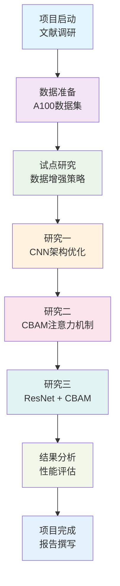
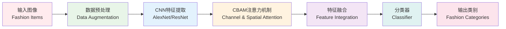

# 我们的深度学习之旅：时尚商品分类项目实战记录

## 🚀 项目概述

在这个快节奏的电商时代，我和我的团队决定挑战一个既有趣又有实际意义的问题：如何让机器"看懂"时尚商品？经过几个月的努力，我们完成了这个基于深度学习的时尚商品分类项目，现在想和大家分享我们的整个开发历程。

### 💡 为什么选择这个项目？

**商业动机：**
- 电商平台上的时尚商品图片数量呈指数级增长
- 需要快速准确地识别产品类别，实现自动标记和智能推荐
- 帮助消费者缩短搜索时间，提升购物体验

**技术动机：**
- 时尚产品图像具有高度复杂性，包含大量变体
- 深度学习特别是CNN在图像识别领域表现出色
- 探索细粒度分类、特征提取和多标签识别的应用

## 🛠️ 技术栈与方法论

我们的项目采用了渐进式的研究方法，通过三个主要研究和一个试点研究来不断优化模型性能：

### 核心技术
- **深度学习框架：** CNN (卷积神经网络)
- **主要架构：** AlexNet, ResNet
- **注意力机制：** CBAM (Channel and Spatial Attention)
- **数据源：** 基于A100框架的时尚数据集
- **开发环境：** Python, Jupyter Notebook

### 研究方法
1. **试点研究：** 选择适当的数据增强方法和训练轮数
2. **研究一：** 比较减少/增加卷积层和修改分类器的方法
3. **研究二：** 在AlexNet中引入CBAM注意力机制
4. **研究三：** 结合更深的ResNet架构与CBAM机制

## 👥 团队协作经历

### 分工与协作
虽然我们是一个小团队，但每个人都发挥了重要作用：

**我的主要贡献：**
- 负责模型架构设计和实验框架搭建
- 实现CBAM注意力机制的集成
- 进行模型性能评估和结果分析

**队友的贡献：**
- 数据预处理和增强策略制定
- 文献调研和相关工作分析  
- 实验结果整理和报告撰写

### 协作工具
- **版本控制：** Git (现在项目已上传到GitHub)
- **文档协作：** 共同编写项目报告
- **实验记录：** Jupyter Notebook进行实验记录和代码共享

## 🔬 项目实施过程

### 项目流程图


### Phase 1: 文献调研与数据准备
我们深入研究了相关工作，包括：
- **FashionNet和DeepFashion：** 基于VGG-16的大规模时尚数据集
- **弱监督学习方法：** 利用ResNet-50处理文本-图像对
- **美学评估框架：** A100框架的LAT和AAT测试

**挑战：** 理解复杂的学术论文和选择合适的基准数据集
**解决方案：** 团队讨论和逐步分解复杂概念

### Phase 2: 模型设计与实验
**试点研究阶段：**
- 测试不同的数据增强技术
- 确定最优的训练轮数
- 建立基准性能指标

**主要研究阶段：**
1. **架构优化：** 尝试不同深度的卷积层配置
2. **注意力机制：** 集成CBAM提升特征提取能力
3. **深度网络：** 使用ResNet获得更好的特征表示

**遇到的困难：**
- 模型训练时间长，需要耐心等待结果
- 超参数调优需要多次实验
- 不同架构间的性能比较需要公平的实验设置

### Phase 3: 结果分析与优化
通过渐进式的三个研究，我们发现：
- 适当的网络深度对性能提升很重要
- 注意力机制能显著改善特征提取
- 深度网络与注意力机制的结合效果最佳

## 📊 项目成果

### 技术成果
- 实现了高效的时尚商品分类模型
- 验证了注意力机制在细粒度分类中的有效性
- 建立了完整的实验评估框架

### 学习收获
**技术技能：**
- 深度学习模型设计与实现
- 注意力机制的原理和应用
- 实验设计和结果分析方法

**软技能：**
- 团队协作和项目管理
- 科技论文阅读和理解
- 问题分解和系统性思考

## 🔧 技术细节分享

### 技术架构图


### 数据处理
我们使用了A100框架提供的数据集，这是一个专门用于评估时尚兼容性模型美学能力的系统框架。数据集包含了丰富的时尚商品图像，为我们的分类任务提供了良好的基础。

### 模型架构
```python
# 伪代码示例：CBAM注意力机制集成
class CBamBlock(nn.Module):
    def __init__(self, channels):
        super(CBamBlock, self).__init__()
        self.channel_attention = ChannelAttention(channels)
        self.spatial_attention = SpatialAttention()
    
    def forward(self, x):
        x = self.channel_attention(x) * x
        x = self.spatial_attention(x) * x
        return x
```

### 实验设计
我们采用了严格的实验对照方法：
- 固定随机种子确保结果可复现
- 使用相同的训练/验证/测试集划分
- 统一的评估指标（准确率、F1分数等）

## 🎯 项目亮点

### 创新点
1. **渐进式研究方法：** 通过三个递进的研究逐步优化模型
2. **注意力机制应用：** 成功将CBAM集成到时尚分类任务中
3. **系统性评估：** 建立了完整的模型评估和比较框架

### 实际应用价值
- 可用于电商平台的自动商品分类
- 支持智能推荐系统的特征提取
- 为时尚搜索引擎提供技术支持

## 🚧 遇到的挑战与解决方案

### 技术挑战
**问题1：模型过拟合**
- 现象：训练精度高但验证精度低
- 解决：增加数据增强、使用Dropout、早停策略

**问题2：训练时间过长**
- 现象：大型模型训练需要很长时间
- 解决：使用GPU加速、批处理优化、模型并行

**问题3：超参数选择困难**
- 现象：不知道如何选择学习率、批大小等
- 解决：网格搜索、随机搜索、贝叶斯优化

### 团队协作挑战
**沟通协调：**
- 建立定期会议制度
- 使用共享文档记录进展
- 明确分工和责任

**进度管理：**
- 制定详细的时间表
- 设置里程碑检查点
- 灵活调整计划

## 🔮 未来改进方向

### 技术优化
1. **模型轻量化：** 探索MobileNet等轻量级架构
2. **多模态融合：** 结合文本描述和图像信息
3. **增量学习：** 支持新类别的在线学习

### 应用拓展
1. **实时分类：** 优化模型推理速度
2. **移动端部署：** 适配移动设备限制
3. **个性化推荐：** 结合用户偏好数据

## 🎉 项目总结

这个时尚商品分类项目不仅让我们掌握了深度学习的核心技术，更重要的是培养了我们的科研思维和团队协作能力。从最初的想法到最终的实现，我们经历了无数次的讨论、实验、失败和改进。

### 主要收获
1. **技术能力提升：** 深入理解了CNN、注意力机制等核心概念
2. **研究方法学习：** 掌握了科学的实验设计和结果分析方法
3. **团队协作经验：** 学会了如何在团队中高效协作
4. **问题解决能力：** 培养了面对困难时的坚持和创新精神

### 对后续学习的启发
这个项目让我们意识到，优秀的AI项目不仅需要扎实的技术基础，还需要：
- 清晰的问题定义和解决思路
- 系统性的实验设计和验证方法
- 持续的学习和改进精神
- 良好的团队协作和沟通能力

## 📚 相关资源

### 项目代码
- **GitHub仓库：** [即将上传到GitHub]
- **主要文件：** `Main_Project_notebook(s).ipynb`
- **项目报告：** `COMP9444_Project_Report_TTPZ.pdf`

### 参考文献
1. Liu et al. (2016) - DeepFashion: Powering Robust Clothes Recognition
2. Corbière et al. (2017) - Leveraging Weakly Annotated Data
3. Zou et al. (2022) - A100: Aesthetic Ability Evaluation Framework

### 学习资源
- 深度学习课程资料
- 相关技术博客和论文
- 开源代码和数据集

---

通过这个项目，我们不仅完成了一个技术挑战，更重要的是建立了深厚的友谊和宝贵的学习经历。希望我们的经验能对其他同学的项目有所帮助！

如果你对我们的项目有任何问题或想法，欢迎随时交流讨论！ 🤝

---

*项目团队：TTPZ小组*  
*完成时间：2024年*  
*课程：COMP9444 深度学习*
